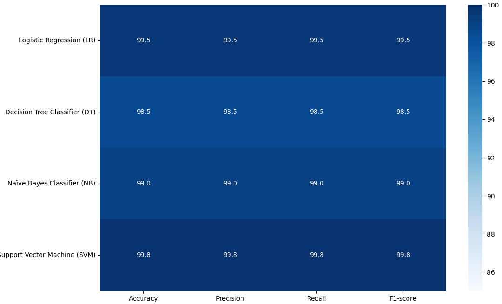

# Language-Detection

## Overview
This project aims to implement a language detection system using machine learning techniques. The system will be capable of identifying the language of a given text input.

## Model Selection
Several machine learning algorithms can be employed for language detection, including:
- Naive Bayes Classifier
- Support Vector Machines (SVM)
- Logistic Regression
- Random Forest
- Neural Networks

The choice of model will depend on factors such as dataset size, feature representation, and computational resources.

## Evaluation
The performance of the language detection model will be assessed using metrics such as accuracy, precision, recall, and F1-score. Cross-validation techniques will be employed to ensure the generalization of the model.

It detects:
1. English - eng
2. Russian - rus
3. Italian - ita
4. Turkish - tur
5. German - deu
6. Spanish - spa
7. French - fra
8. Portuguese - por
9. Hungarian - hun
10. Japanese - jpn
11. Ukrainian - ukr
12. Dutch - nld
13. Polish - pol
14. Marathi - mar
15. Arabic - ara
16. Swedish - swe
17. Latin - lat
18. Greek - ell
19. Romanian - ron
20. Persian - pes
21. Bulgarian - bul
22. Vietnamese - vie
23. Indonesian - ind
24. Hindi - hin
25. Bengali - ben
26. Korean - kor
